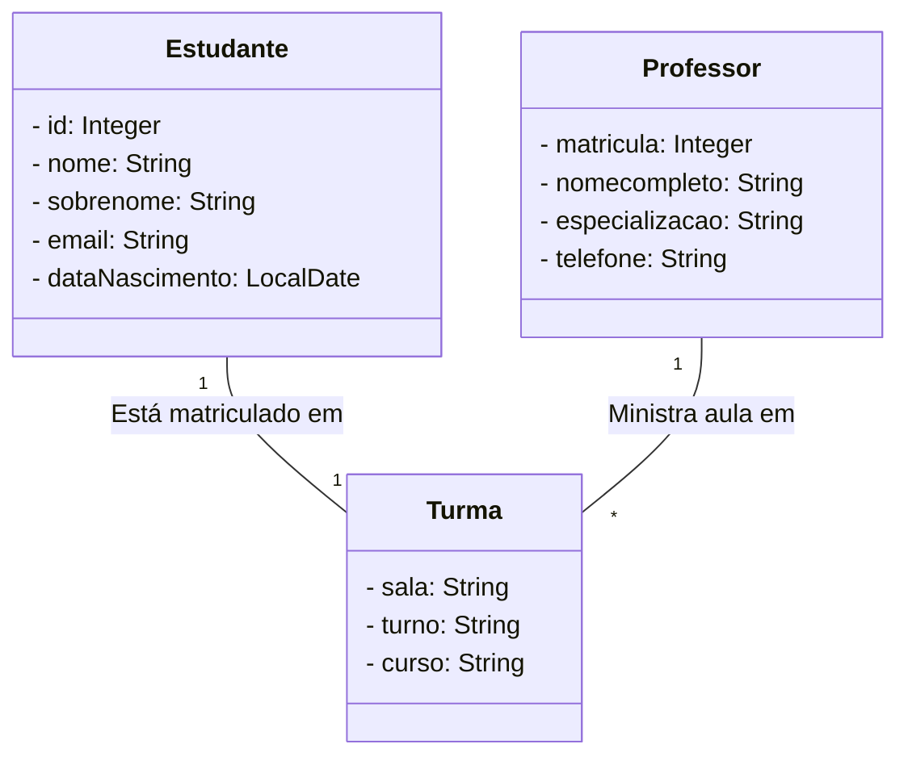

# API de Gerenciamento de Escola/Curso

## Descrição do Projeto

Este projeto consiste em uma API para gerenciamento de estudantes. Ela permite a criação, leitura, atualização e exclusão de registros de estudantes em um banco de dados. Além disso, a API fornece endpoints para realizar operações relacionadas a professores e turmas.

## Como Rodar a Aplicação

Para rodar a aplicação em seu ambiente de desenvolvimento, siga os passos abaixo:

1. Clone este repositório em seu computador.

2. Certifique-se de ter o Java JDK e o Apache Maven instalados.

3. Execute o comando `mvn spring-boot:run` para iniciar a aplicação.

A aplicação estará disponível em [http://localhost:8080](http://localhost:8080).

## Como Rodar os Testes

Para executar os testes da aplicação, utilize o seguinte comando:

## Deploy da Aplicação

Para fazer o deploy da aplicação em um ambiente de produção, siga as práticas recomendadas de implantação do Spring Boot. Você pode usar ferramentas como Docker e Kubernetes para simplificar o processo de implantação.

## Contato

Para entrar em contato, envie um e-mail para [jocasilvalima@gmail.com](mailto:jocasilvalima@gmail.com).

## Licença

Este projeto está sob a Licença MIT - consulte o arquivo [LICENSE](LICENSE) para obter mais detalhes.

## Agradecimentos

Agradecemos à comunidade de desenvolvedores e aos contribuidores por seu apoio e contribuições para este projeto.

# Diagrama de Classes

